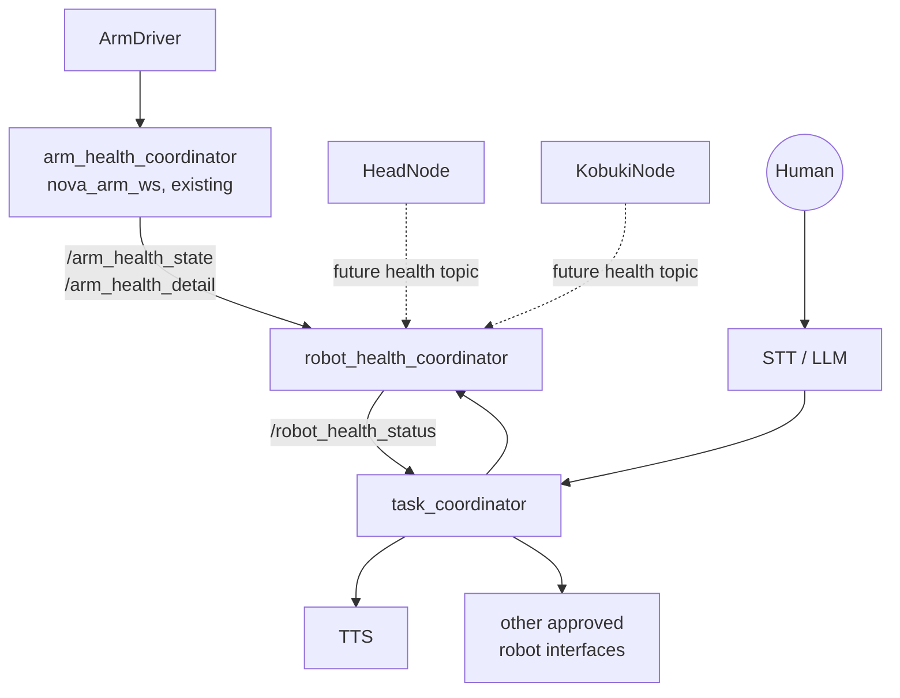

# Sudo-Health-Monitoring-System

## Overview

This project is a continuation and expansion of the health monitoring and
recovery system originally developed for the Nova Arm in
[`nova_arm_ws`](../nova_arm_ws). That system watches the arm's Dynamixel
servos through `ArmDriver`'s `/arm_servo_status` topic, diagnoses known
faults, and runs narrowly-scoped recovery procedures (see
`arm_health_coordinator.py`).

This project keeps that arm system as-is and builds a **robot-wide** layer on
top of it: a coordinator that aggregates the health of every major
subsystem (arms, head, mobile base, and future additions), and a second
coordinator that lets the robot talk about its own condition in natural
language.

## Why this project exists

As Sudo grows beyond the arm, "is the robot okay?" stops being a
single-subsystem question. Hardware needs one place that knows the state of
every subsystem, independent of which drivers happen to be running at the
time. NLP needs one place to ask that question and turn the answer into
something a human can understand, without needing to know anything about
Dynamixel registers, serial ports, or diagnostic message formats.

Splitting the problem this way lets both teams work independently:
Hardware defines what "healthy" means for each subsystem and how faults get
fixed; NLP defines how the robot talks about it.

## Relationship to `nova_arm_ws`

`nova_arm_ws` is not being replaced. `ArmDriver` and `arm_health_coordinator`
continue to own arm hardware access and arm-specific diagnosis/recovery
exactly as they do today:

```text
ArmDriver  --/arm_servo_status-->  arm_health_coordinator
                                          |
                          /arm_health_state, /arm_health_detail,
                                 /arm_motion_allowed
```

`robot_health_coordinator` (this repo) treats `arm_health_coordinator`'s
published state as the authoritative summary of arm health — it does not
re-read raw servo diagnostics or re-implement arm fault logic. This is the
same pattern every other subsystem is expected to follow: a subsystem-level
health node (existing or future) owns the low-level diagnosis, and
`robot_health_coordinator` only aggregates the summaries.

## Overall architecture

```text
                 ArmDriver
                     |
                     v
          arm_health_coordinator  (nova_arm_ws, existing)
                     |
                     |   HeadNode                KobukiNode
                     |      |                        |
                     |      v                        v
                     |  (future head            (future base
                     |   health node)             health node)
                     |      |                        |
                     v      v                        v
              +-------------------------------------------+
              |          robot_health_coordinator          |
              |   (Hardware/Control team, this repo)       |
              +-------------------------------------------+
                              |
                              v
              +-------------------------------------------+
              |             task_coordinator                |
              |   (NLP team, this repo)                     |
              +-------------------------------------------+
                 |            |              |
                 v            v              v
                TTS      STT / LLM     other approved
                                        robot interfaces
                              ^
                              |
                            Human
```

Or as Mermaid:



### 1. `robot_health_coordinator`

Owned primarily by the **Hardware/Control team**.

Aggregates and reasons about the health of the robot's hardware subsystems.
It consumes status from subsystem-level sources:

```text
arm_health_coordinator (arm, via nova_arm_ws)  ───┐
HeadNode / future head health node             ───┼──► robot_health_coordinator
KobukiNode / future base health node           ───┘
```

Initial target subsystems: **arms**, **head pan/tilt system**, **mobile
base**. Additional sensors and hardware can be added later without changing
this architecture.

The coordinator monitors each subsystem independently, tracks whether it is
even reachable, and exposes a single robot-level health result that other
nodes — chiefly `task_coordinator` — can consume.

### 2. `task_coordinator`

Owned primarily by the **NLP team**, with substantial collaboration from
Hardware.

Acts as the high-level task/interface layer between the LLM, TTS, and the
robot's existing coordinators:

```text
Human
  |
  v
STT / LLM
  |
  v
task_coordinator
  |--> TTS
  |--> robot_health_coordinator
  |--> Presenter / task coordinators
  `--> other approved robot interfaces
```

`task_coordinator` never controls hardware directly and never bypasses
hardware drivers. It asks `robot_health_coordinator` what the robot's state
is, and decides how to respond to a human request in light of that state.

## Boundaries this project preserves

```text
ArmDriver / HeadNode / KobukiNode
    = hardware access + hardware status

robot_health_coordinator
    = hardware health aggregation + diagnosis + approved recovery coordination

task_coordinator
    = high-level task / interaction orchestration

LLM
    = natural-language understanding and intent/tool selection

TTS
    = speech output
```

No single node does more than one of these jobs. In particular:

* `robot_health_coordinator` never opens a serial port, never touches
  Dynamixel registers directly, and never publishes motor commands. It also
  does not own TTS or conversational behavior.
* `task_coordinator` never manipulates hardware registers, never controls
  Dynamixel motors directly, and never re-implements the diagnosis logic
  that lives in `robot_health_coordinator` (or in `arm_health_coordinator`).
* The LLM selects from approved, high-level capabilities. It does not get
  direct access to motors, registers, or serial ports.

## Current hardware situation

### Arms: temporary single-arm, target dual-arm

The robot currently runs a **single-arm** `ArmDriver` because the custom
Power Distribution Board for the final two-arm setup has not arrived. The
**intended configuration is two independent arms**.

The dual-arm `ArmDriver` will have, per arm: a separate serial bus, a
separate serial interface, and separate joint/servo ID mappings, with a
shared external ROS interface where it makes sense.

**The health architecture must not assume there is only one arm, and must
not assume a servo ID alone uniquely identifies a servo.** For example, it
must be able to distinguish `right arm -> servo 1` from `left arm -> servo
11`, or an equivalent semantic identity. `robot_health_coordinator` keys arm
subsystem state by an explicit subsystem name (e.g. `arm` today, expected to
become `arm_left` / `arm_right`) rather than by raw servo ID, specifically
so the dual-arm case is a configuration change rather than a redesign.

### Existing arm health interface

`ArmDriver` already publishes `/arm_servo_status`
(`diagnostic_msgs/DiagnosticArray`) with, per servo: communication state,
torque enable, goal position, present position, load, voltage, temperature,
torque limit, max torque, and hardware error flags. `arm_health_coordinator`
consumes that topic, diagnoses known faults, and exposes narrowly-scoped
recovery services (e.g. `/arm/servo_<id>/restore_torque_limit`) plus its own
summary topics (`/arm_health_state`, `/arm_health_detail`,
`/arm_motion_allowed`).

`robot_health_coordinator` builds on this by subscribing to the
`arm_health_coordinator` summary topics, not by re-reading raw servo
diagnostics or duplicating driver-level recovery logic.

### HeadNode: health interface does not exist yet

`HeadNode` currently controls the head pan/tilt and cat-head motors via
`/head/pan_target`, `/head/tilt_target`, `/cat/joint1_target`, and
`/cat/joint2_target`. **It does not currently publish any health/status
information.** This is future Hardware/Control work: extend `HeadNode` (or
add a companion node) so it reports servo/communication state in a form
`robot_health_coordinator` can consume — most likely a
`diagnostic_msgs/DiagnosticArray`, mirroring the arm's
`/arm_servo_status` pattern. `robot_health_coordinator` does not assume this
interface exists yet; it treats the head subsystem as `UNKNOWN` until it
does.

### KobukiNode: health interface does not exist yet

The same applies to the mobile base. A health/status interface for the base
driver needs to be added by the Hardware/Control team.
`robot_health_coordinator` will consume it once it exists, and treats the
base subsystem as `UNKNOWN` in the meantime.

## Missing drivers must not break the coordinator

The robot is routinely run with only some drivers active — for example,
`ArmDriver` and `HeadNode` running while `KobukiNode` is not. In that
situation `robot_health_coordinator` must keep running correctly.

A missing driver, a missing status publisher, or a subsystem that has never
reported in is represented with a non-fault state — `UNKNOWN` or
`UNAVAILABLE` — never assumed to mean "physically broken." This lets the
coordinator report something like:

```text
ARM  = HEALTHY
HEAD = HEALTHY
BASE = UNKNOWN
```

while staying fully operational. This matters for day-to-day development,
partial-robot bring-up, and bench testing of a single subsystem.

## Example interaction

```text
Human: "Are you okay?"

task_coordinator / LLM: requests robot health from robot_health_coordinator

robot_health_coordinator:
  ARM  = HEALTHY
  HEAD = HEALTHY
  BASE = UNKNOWN

task_coordinator / LLM: "The arms and head are healthy. I don't currently
have a status report from my mobile base."
```

The exact conversational wording is NLP's responsibility; `task_coordinator`
only needs to expose the structured state above.

## Team ownership

### Hardware / Control team

* Hardware driver health/status interfaces (`ArmDriver`, `HeadNode`,
  `KobukiNode`)
* Hardware fault definitions and diagnostics
* Hardware-specific recovery procedures
* `robot_health_coordinator`
* What counts as healthy / degraded / fault / unknown for each subsystem
* Safety-related restrictions and hardware recovery boundaries

### Software / NLP team

* LLM integration, tool/function-calling interface
* STT integration
* TTS integration
* `task_coordinator`
* Human-facing conversational behavior
* Mapping human requests to approved high-level robot capabilities

### Shared responsibility

* The `robot_health_coordinator` <-> `task_coordinator` interface
* ROS message/service/action interface design
* Naming conventions
* Robot-wide state semantics (what `HEALTHY` / `DEGRADED` / `FAULT` /
  `UNKNOWN` / `RECOVERING` mean at the robot level, not just per-subsystem)
* Integration testing and end-to-end demonstrations
* Deciding what information is actually useful to say to a human

`task_coordinator` is generally NLP-owned; `robot_health_coordinator` is
generally Control-owned. The interface between them is everyone's job.

## Repository layout

```text
Sudo-Health-Monitoring-System/
├── README.md
├── robot_health_coordinator/            # ament_python ROS2 package
│   ├── package.xml
│   ├── setup.py
│   ├── setup.cfg
│   ├── resource/robot_health_coordinator
│   └── robot_health_coordinator/
│       ├── __init__.py
│       └── robot_health_coordinator.py
└── task_coordinator/                    # ament_python ROS2 package
    ├── package.xml
    ├── setup.py
    ├── setup.cfg
    ├── resource/task_coordinator
    └── task_coordinator/
        ├── __init__.py
        └── task_coordinator.py
```

## Expected ROS2 interfaces (current state)

| Topic / Service | Type | Direction | Status |
|---|---|---|---|
| `/arm_health_state` | `std_msgs/String` | `robot_health_coordinator` subscribes | exists (`nova_arm_ws`) |
| `/arm_health_detail` | `std_msgs/String` (JSON) | `robot_health_coordinator` subscribes | exists (`nova_arm_ws`) |
| `/head_health_status` | TBD, likely `diagnostic_msgs/DiagnosticArray` | `robot_health_coordinator` subscribes | **TODO — HeadNode work** |
| `/base_health_status` | TBD, likely `diagnostic_msgs/DiagnosticArray` | `robot_health_coordinator` subscribes | **TODO — KobukiNode work** |
| `/robot_health_status` | `std_msgs/String` (JSON), latched | `robot_health_coordinator` publishes | placeholder, this repo |
| `/robot_health_event` | `std_msgs/String` | `robot_health_coordinator` publishes | placeholder, this repo |
| `/task_coordinator/query` | TBD service, likely `std_srvs/Trigger`-like | `task_coordinator` internal client | placeholder, this repo |

These are intentionally simple placeholders (mostly `String`/JSON) rather
than a bespoke message package, so the exact schema can evolve as HeadNode
and KobukiNode health work lands, without a disruptive interface migration.

## What future contributors should implement next

**Hardware/Control:**

1. Add a health/status publisher to `HeadNode` (or a companion node),
   mirroring `/arm_servo_status`'s shape where reasonable.
2. Add the equivalent for the base driver (`KobukiNode`).
3. Fill in `_evaluate_head()` and `_evaluate_base()` in
   `robot_health_coordinator.py` once those topics exist.
4. Extend the arm side of `robot_health_coordinator` for the dual-arm
   configuration (two subsystem entries instead of one) once the
   dual-arm `ArmDriver` lands.
5. Define what, if any, robot-level recovery orchestration
   `robot_health_coordinator` should perform beyond what
   `arm_health_coordinator` already does per-subsystem, and implement it in
   the marked TODO section.

**Software/NLP:**

1. Replace the placeholder keyword matching in `task_coordinator.py`'s
   `_handle_user_text()` with real STT + LLM tool-calling.
2. Implement the TTS output hook (`_speak()`).
3. Design the LLM's tool/function schema for querying
   `robot_health_coordinator` and any other approved interfaces.
4. Decide the final wording strategy for turning structured health state
   into natural language.

**Shared:**

1. Agree on final message types for `/head_health_status` and
   `/base_health_status` (a plain `diagnostic_msgs/DiagnosticArray`, like
   the arm, is the default assumption here).
2. Agree on the final schema of `/robot_health_status`'s JSON payload.
3. Write an integration test that starts only a subset of drivers and
   confirms `robot_health_coordinator` reports `UNKNOWN` for the missing
   ones without crashing.
