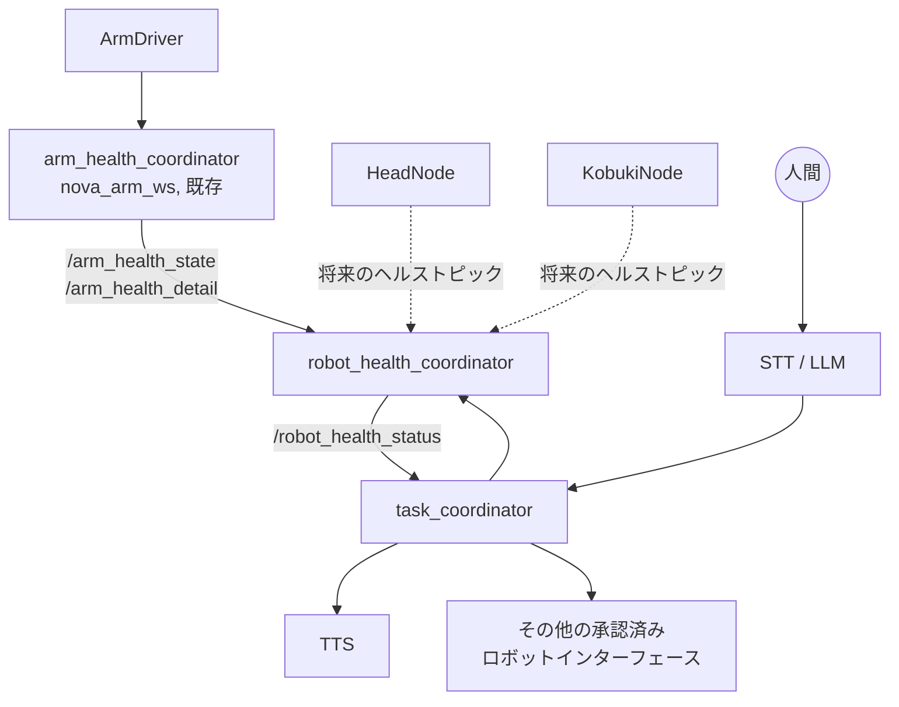

# Sudo-Health-Monitoring-System

## 概要

本プロジェクトは、[`nova_arm_ws`](../nova_arm_ws) で開発された Nova Arm 用の
ヘルスモニタリング・リカバリーシステムを継承・拡張するものです。そのシステムは
`ArmDriver` の `/arm_servo_status` トピックを通じてアームの Dynamixel サーボを
監視し、既知の故障を診断し、限定的なスコープのリカバリー手順を実行します
（`arm_health_coordinator.py` 参照)。

本プロジェクトでは、既存のアームシステムをそのまま維持しつつ、その上に
**ロボット全体**を対象とするレイヤーを構築します。各サブシステム（アーム、頭部、
モバイルベース、および将来追加されるもの)のヘルス状態を集約するコーディネーターと、
ロボットが自身の状態を自然言語で伝えられるようにする、もう一つのコーディネーターです。

## このプロジェクトが存在する理由

Sudo がアーム単体の枠を超えて成長するにつれ、「ロボットは大丈夫か?」という問いは
単一サブシステムだけの問題ではなくなります。ハードウェアチームには、どのドライバーが
その時点で稼働しているかに関わらず、全サブシステムの状態を把握できる一元的な場所が
必要です。NLP チームには、その問いを投げかけ、答えを人間が理解できる形に変換できる
一元的な場所が必要です。人間には Dynamixel のレジスタやシリアルポート、診断メッセージの
フォーマットを一切知らなくても済むようにする必要があります。

この分割により両チームが独立して作業できます。ハードウェアチームは各サブシステムに
とっての「健全」の意味と、故障の直し方を定義します。NLP チームは、ロボットがそれを
どう語るかを定義します。

## `nova_arm_ws` との関係

`nova_arm_ws` は置き換えられるわけではありません。`ArmDriver` と
`arm_health_coordinator` は今まで通り、アームのハードウェアアクセスと
アーム固有の診断・リカバリーを担い続けます:

```text
ArmDriver  --/arm_servo_status-->  arm_health_coordinator
                                          |
                          /arm_health_state, /arm_health_detail,
                                 /arm_motion_allowed
```

`robot_health_coordinator`（本リポジトリ)は、`arm_health_coordinator` が
発行する状態を、アームの健全性に関する権威あるサマリーとして扱います。生のサーボ
診断情報を読み直したり、アームの故障ロジックを再実装したりはしません。これは他の
すべてのサブシステムにも適用されるべき同じパターンです。サブシステムレベルの
ヘルスノード（既存または将来のもの)が低レベルの診断を担い、
`robot_health_coordinator` はそのサマリーを集約するだけです。

## 全体アーキテクチャ

```text
                 ArmDriver
                     |
                     v
          arm_health_coordinator  (nova_arm_ws, 既存)
                     |
                     |   HeadNode                KobukiNode
                     |      |                        |
                     |      v                        v
                     |  (将来の頭部              (将来のベース
                     |   ヘルスノード)             ヘルスノード)
                     |      |                        |
                     v      v                        v
              +-------------------------------------------+
              |          robot_health_coordinator          |
              |   (ハードウェア/制御チーム, 本リポジトリ)    |
              +-------------------------------------------+
                              |
                              v
              +-------------------------------------------+
              |             task_coordinator                |
              |   (NLP チーム, 本リポジトリ)                 |
              +-------------------------------------------+
                 |            |              |
                 v            v              v
                TTS      STT / LLM     その他の承認済み
                                        ロボットインターフェース
                              ^
                              |
                            人間
```

または Mermaid 記法で:



### 1. `robot_health_coordinator`

主に **ハードウェア/制御チーム** が所有します。

ロボットのハードウェアサブシステムの健全性を集約・判断します。サブシステム
レベルの発信元からステータスを受け取ります:

```text
arm_health_coordinator (アーム, nova_arm_ws 経由)  ───┐
HeadNode / 将来の頭部ヘルスノード                  ───┼──► robot_health_coordinator
KobukiNode / 将来のベースヘルスノード              ───┘
```

初期の対象サブシステムは **アーム**、**頭部パン/チルトシステム**、
**モバイルベース** です。将来的にはこのアーキテクチャを変えることなく、
他のセンサーやハードウェアを追加できます。

このコーディネーターは各サブシステムを独立して監視し、そもそも到達可能かどうかを
追跡し、他のノード（主に `task_coordinator`)が利用できる単一のロボットレベルの
ヘルス結果を公開します。

### 2. `task_coordinator`

主に **NLP チーム** が所有し、ハードウェアチームと密接に連携します。

LLM、TTS、そしてロボットの既存コーディネーター群の間をつなぐ高レベルの
タスク/インターフェース層として機能します:

```text
人間
  |
  v
STT / LLM
  |
  v
task_coordinator
  |--> TTS
  |--> robot_health_coordinator
  |--> Presenter / その他のタスクコーディネーター
  `--> その他の承認済みロボットインターフェース
```

`task_coordinator` はハードウェアを直接制御することも、ハードウェアドライバーを
迂回することも一切ありません。ロボットの状態について `robot_health_coordinator`
に問い合わせ、その状態を踏まえて人間からの要求にどう応じるかを判断します。

## このプロジェクトが維持する境界

```text
ArmDriver / HeadNode / KobukiNode
    = ハードウェアアクセス + ハードウェアステータス

robot_health_coordinator
    = ハードウェアヘルスの集約 + 診断 + 承認済みリカバリーの調整

task_coordinator
    = 高レベルなタスク/対話のオーケストレーション

LLM
    = 自然言語理解と意図/ツール選択

TTS
    = 音声出力
```

どのノードもこれらのうち複数の役割を兼ねることはありません。具体的には:

* `robot_health_coordinator` はシリアルポートを開くことも、Dynamixel の
  レジスタを直接操作することも、モーターコマンドを発行することもありません。
  また TTS や対話的な振る舞いを持つこともありません。
* `task_coordinator` はハードウェアのレジスタを操作することも、Dynamixel
  モーターを直接制御することも、`robot_health_coordinator`（や
  `arm_health_coordinator`)にある診断ロジックを再実装することもありません。
* LLM は承認済みの高レベルな機能の中から選択します。モーター、レジスタ、
  シリアルポートに直接アクセスすることはありません。

## 現在のハードウェア状況

### アーム: 暫定的なシングルアーム、目標はデュアルアーム

最終的な2アーム構成用のカスタム電源分配基板(PDB)がまだ届いていないため、
現在ロボットは **シングルアーム** の `ArmDriver` で稼働しています。
**意図されている構成は独立した2本のアーム** です。

デュアルアーム版の `ArmDriver` は、アームごとに: 個別のシリアルバス、
個別のシリアルインターフェース、個別の関節/サーボ ID マッピングを持ち、
必要に応じて外部への ROS インターフェースを共有します。

**ヘルスアーキテクチャは、アームが1本しかないという前提や、サーボ ID
単独でサーボを一意に識別できるという前提を置いてはいけません。**
例えば、`右アーム → サーボ1` と `左アーム → サーボ11` （あるいはそれに
相当する意味的な識別)を区別できる必要があります。`robot_health_coordinator`
は、アームサブシステムの状態を生のサーボ ID ではなく明示的なサブシステム名
（現在は `arm`、将来的には `arm_left` / `arm_right` になる想定)で管理して
います。これは、デュアルアーム化を再設計ではなく設定変更で済むようにする
ためです。

### 既存のアームヘルスインターフェース

`ArmDriver` はすでに `/arm_servo_status`
(`diagnostic_msgs/DiagnosticArray`) を発行しており、サーボごとに: 通信状態、
トルクイネーブル、目標位置、現在位置、負荷、電圧、温度、トルクリミット、
最大トルク、ハードウェアエラーフラグを含みます。`arm_health_coordinator` は
このトピックを購読し、既知の故障を診断し、限定的なスコープのリカバリー
サービス（例: `/arm/servo_<id>/restore_torque_limit`)と、自身のサマリー
トピック(`/arm_health_state`、`/arm_health_detail`、`/arm_motion_allowed`)
を公開します。

`robot_health_coordinator` は、生のサーボ診断情報を読み直したり、ドライバー
レベルのリカバリーロジックを重複実装したりするのではなく、
`arm_health_coordinator` のサマリートピックを購読することでこれを利用します。

### HeadNode: ヘルスインターフェースはまだ存在しない

`HeadNode` は現在、`/head/pan_target`、`/head/tilt_target`、
`/cat/joint1_target`、`/cat/joint2_target` を通じて頭部のパン/チルトと
猫耳頭部のモーターを制御しています。**現時点ではヘルス/ステータス情報を
一切発行していません。** これは今後のハードウェア/制御チームの作業です:
`HeadNode`（またはコンパニオンノード)を拡張し、`robot_health_coordinator`
が利用できる形でサーボ/通信状態を報告できるようにする必要があります。
最も可能性が高いのは、アームの `/arm_servo_status` と同じパターンに倣った
`diagnostic_msgs/DiagnosticArray` です。`robot_health_coordinator` は
このインターフェースが既に存在するとは想定しておらず、それが存在するまで
頭部サブシステムを `UNKNOWN` として扱います。

### KobukiNode: ヘルスインターフェースはまだ存在しない

モバイルベースについても同様です。ベースドライバー用のヘルス/ステータス
インターフェースは、ハードウェア/制御チームによって追加される必要があります。
それが存在するようになれば `robot_health_coordinator` が利用しますが、
それまではベースサブシステムを `UNKNOWN` として扱います。

## ドライバーの欠落がコーディネーターを壊してはいけない

ロボットは、一部のドライバーだけが稼働している状態で開発・テストされることが
日常的にあります。例えば `ArmDriver` と `HeadNode` が稼働していて
`KobukiNode` が稼働していない、といった状況です。そのような場合でも
`robot_health_coordinator` は正しく動作し続けなければなりません。

ドライバーの欠落、ステータスパブリッシャーの欠落、一度も報告してきたことのない
サブシステムは、非故障状態 — `UNKNOWN` または `UNAVAILABLE` — として表現され、
決して「物理的に壊れている」ことを意味するとは想定されません。これにより
コーディネーターは以下のような状態を報告しつつ、

```text
ARM  = HEALTHY
HEAD = HEALTHY
BASE = UNKNOWN
```

完全に稼働し続けることができます。これは日常の開発、ロボット一部のみの
立ち上げ、単一サブシステムのベンチテストにとって重要です。

## やり取りの例

```text
人間: 「大丈夫?」

task_coordinator / LLM: robot_health_coordinator にロボットのヘルスを問い合わせる

robot_health_coordinator:
  ARM  = HEALTHY
  HEAD = HEALTHY
  BASE = UNKNOWN

task_coordinator / LLM: 「アームと頭部は問題ありません。モバイルベースからの
ステータスレポートは今のところ受け取れていません。」
```

正確な会話の文言は NLP チームの責任です。`task_coordinator` は上記のような
構造化された状態を公開しさえすればよいのです。

## チームの所有権

### ハードウェア/制御チーム

* ハードウェアドライバーのヘルス/ステータスインターフェース(`ArmDriver`、
  `HeadNode`、`KobukiNode`)
* ハードウェアの故障定義と診断
* ハードウェア固有のリカバリー手順
* `robot_health_coordinator`
* 各サブシステムにとって何が healthy / degraded / fault / unknown に
  あたるか
* 安全に関する制約とハードウェアリカバリーの境界

### ソフトウェア/NLP チーム

* LLM 統合、ツール/関数呼び出しインターフェース
* STT 統合
* TTS 統合
* `task_coordinator`
* 人間向けの対話的な振る舞い
* 人間からの要求を承認済みの高レベルなロボット機能へマッピングすること

### 共有責任

* `robot_health_coordinator` ↔ `task_coordinator` インターフェース
* ROS のメッセージ/サービス/アクションのインターフェース設計
* 命名規則
* ロボット全体の状態の意味論(`HEALTHY` / `DEGRADED` / `FAULT` /
  `UNKNOWN` / `RECOVERING` がサブシステムレベルだけでなくロボットレベルで
  何を意味するか)
* 統合テストとエンドツーエンドのデモンストレーション
* 人間に伝えるべき情報が実際に何なのかを決めること

`task_coordinator` は基本的に NLP チームが所有し、`robot_health_coordinator`
は基本的にハードウェア/制御チームが所有します。両者の間のインターフェースは
全員の仕事です。

## リポジトリ構成

```text
Sudo-Health-Monitoring-System/
├── README.md
├── README.ja.md                         # 本ファイル(日本語版)
├── robot_health_coordinator/            # ament_python ROS2 パッケージ
│   ├── package.xml
│   ├── setup.py
│   ├── setup.cfg
│   ├── resource/robot_health_coordinator
│   └── robot_health_coordinator/
│       ├── __init__.py
│       └── robot_health_coordinator.py
└── task_coordinator/                    # ament_python ROS2 パッケージ
    ├── package.xml
    ├── setup.py
    ├── setup.cfg
    ├── resource/task_coordinator
    └── task_coordinator/
        ├── __init__.py
        └── task_coordinator.py
```

## 想定される ROS2 インターフェース(現時点)

| トピック/サービス | 型 | 方向 | 状態 |
|---|---|---|---|
| `/arm_health_state` | `std_msgs/String` | `robot_health_coordinator` が購読 | 既存 (`nova_arm_ws`) |
| `/arm_health_detail` | `std_msgs/String` (JSON) | `robot_health_coordinator` が購読 | 既存 (`nova_arm_ws`) |
| `/head_health_status` | 未確定、おそらく `diagnostic_msgs/DiagnosticArray` | `robot_health_coordinator` が購読 | **TODO — HeadNode 側の作業** |
| `/base_health_status` | 未確定、おそらく `diagnostic_msgs/DiagnosticArray` | `robot_health_coordinator` が購読 | **TODO — KobukiNode 側の作業** |
| `/robot_health_status` | `std_msgs/String` (JSON), latched | `robot_health_coordinator` が発行 | プレースホルダー、本リポジトリ |
| `/robot_health_event` | `std_msgs/String` | `robot_health_coordinator` が発行 | プレースホルダー、本リポジトリ |
| `/task_coordinator/query` | 未確定、おそらく `std_srvs/Trigger` 相当のサービス | `task_coordinator` 内部のクライアント | プレースホルダー、本リポジトリ |

これらは意図的に単純なプレースホルダー(ほとんどが `String`/JSON)であり、
独自のメッセージパッケージを作り込むのではなく、HeadNode と KobukiNode の
ヘルス関連の作業が進むにつれて、大きなインターフェース移行を伴わずに
スキーマを進化させられるようにしています。

## 今後の貢献者が次に実装すべきこと

**ハードウェア/制御チーム:**

1. `HeadNode`（またはコンパニオンノード)にヘルス/ステータスパブリッシャーを
   追加する。`/arm_servo_status` の形に可能な範囲で倣うこと。
2. ベースドライバー(`KobukiNode`)についても同様のものを追加する。
3. それらのトピックが存在するようになったら、`robot_health_coordinator.py`
   の `_evaluate_head()` と `_evaluate_base()` を実装する。
4. デュアルアーム版 `ArmDriver` がリリースされたら、`robot_health_
   coordinator` のアーム側を(1エントリではなく)2エントリに拡張する。
5. `arm_health_coordinator` が既にサブシステムごとに行っているもの以外に、
   `robot_health_coordinator` がロボットレベルで行うべきリカバリーの
   オーケストレーションがあるかどうかを定義し、該当する TODO 箇所に実装する。

**ソフトウェア/NLP チーム:**

1. `task_coordinator.py` の `_handle_user_text()` にあるプレースホルダーの
   キーワードマッチングを、実際の STT + LLM のツール呼び出しに置き換える。
2. TTS 出力のフック(`_speak()`)を実装する。
3. `robot_health_coordinator` やその他の承認済みインターフェースを
   問い合わせるための LLM のツール/関数スキーマを設計する。
4. 構造化されたヘルス状態を自然言語に変換する最終的な文言戦略を決める。

**共有:**

1. `/head_health_status` と `/base_health_status` の最終的なメッセージ型に
   ついて合意する(本リポジトリでは、アームと同様の単純な
   `diagnostic_msgs/DiagnosticArray` をデフォルトの想定としています)。
2. `/robot_health_status` の JSON ペイロードの最終スキーマについて合意する。
3. ドライバーの一部だけを起動した状態でも `robot_health_coordinator` が
   クラッシュせず、足りないものについて `UNKNOWN` を正しく報告することを
   確認する統合テストを書く。
